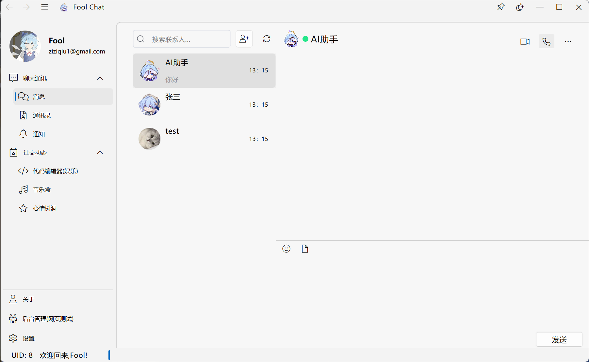
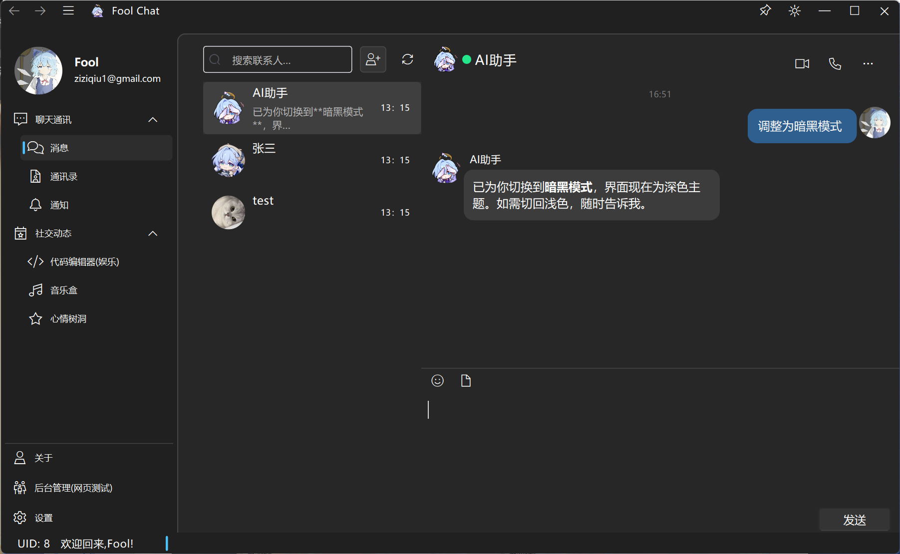
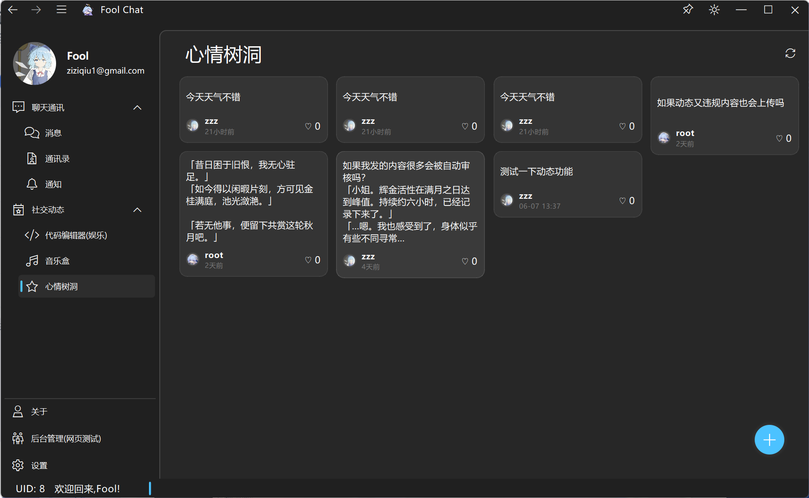
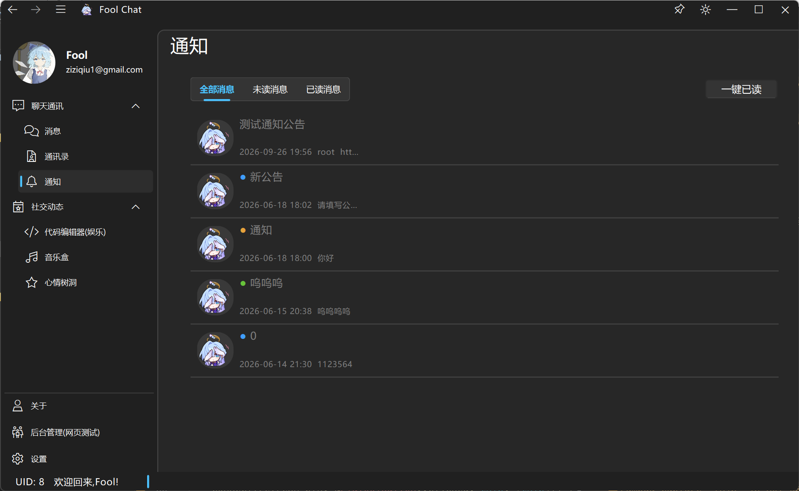
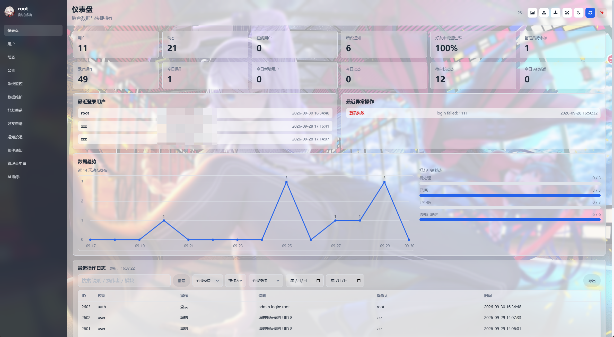
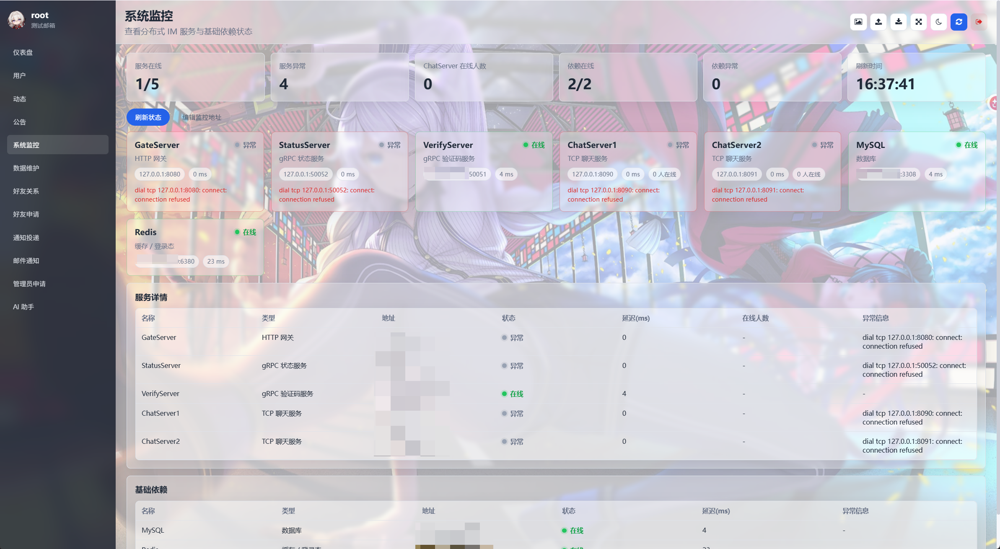

# FoolChat — 分布式即时通讯系统

FoolChat 是一套完整的分布式即时通讯系统项目集合：C++ 服务端（Boost.Asio + gRPC，MSVC x64）、Node.js 验证码服务、Go Web 后台管理端、Qt6 桌面客户端。各服务通过 gRPC、Redis 与 MySQL 协作，完成注册、登录、负载均衡、实时消息与跨服务器转发。

## 项目列表

| 项目 | 说明 |
|------|------|
| [GateServer](./GateServer/) | HTTP 网关（Boost.Beast，:8080）。接收客户端的注册 / 登录 / 重置密码 / 验证码请求，校验 MySQL 后联动 StatusServer 完成登录，下发 uid、token 与 ChatServer 地址 |
| [VarifyServer](./VarifyServer/) | Node.js gRPC 验证码服务（:50051）。生成邮箱验证码，经 SMTP 发送，并写入 Redis（600 秒有效） |
| [StatusServer](./StatusServer/) | gRPC 状态服务（:50052）。按 Redis 在线人数为登录用户分配负载最低的 ChatServer，并签发登录 token |
| [ChatServer](./ChatServer/) | TCP 实时消息服务实例 1（TCP :8090 / gRPC :50055）。会话管理、消息路由与跨服转发 |
| [ChatServer2](./ChatServer2/) | TCP 实时消息服务实例 2（TCP :8091 / gRPC :50056）。与实例 1 共享代码，靠 `config.ini` 的 `[SelfServer]` 段区分身份 |
| [Fool_Chat_Client](./Fool_Chat_Client/) | Qt6 桌面客户端（Fluent Design / ElaWidgetTools）。聊天、通讯录、动态、音乐、公告，以及内嵌的后台管理页 |
| [fool_chat_admin_go](./fool_chat_admin_go/) | Go Web 后台管理端（:9100）。管理用户、动态、公告、通知、管理员申请，带服务监控、数据备份与 AI 助手 |

## 系统架构

### 服务拓扑

```text
+--------------------+                                    +--------------------+
| Fool_Chat_Client   |  -- HTTP :8080 /user_login ---->   |    GateServer      |
|  (Qt6 desktop)     |                                    |  HTTP gateway      |
+---------+----------+                                    +----+----------+----+
          |                                                   |          |
          | TCP :8090 / :8091                                 | gRPC     | gRPC
          | 1005 CHAT_LOGIN                                   |          |
          |                                                   v          v
          |                                +--------------------+  +--------------------+
          +------------------------------->|   ChatServer 1 / 2 |  |   StatusServer     |
                                           |  TCP + gRPC        |  |   :50052           |
                                           |  :8090/:8091       |  |   load balancing   |
                                           +---------+----------+  +---------+----------+
                                                     |                       |
                       gRPC Notify* (跨服转发)        |                       |
                       ChatServer1 <------------->   |                       |
                                                     |                       |
          +--------------------+                     |                       |
          |  VarifyServer      |<--(GateServer 调用)--+-----------------------+
          |  :50051 邮箱验证码    |
          +---------+----------+
                    |
    +---------------+----------------------+
    |               |                      |
    v               v                      v (SMTP)
+--------------------+            +--------------------+          +-----------+
|      Redis         |            |   MySQL (mhkh)    |          |  163 邮箱  |
| code_     验证码    |            | user / friend     |          |  发验证码   |
| utoken_   登录token |            | dynamic / apply   |          +-----------+
| uip_      用户路由   |            | user_id ...       |
| logincount 在线人数  |            +--------------------+
+--------------------+

+--------------------+
| fool_chat_admin_go |  Web 管理端 :9100，浏览器或 Qt 客户端
| 共享 MySQL / Redis  |  内置「后台管理」页访问
+--------------------+
```

- **GateServer**（:8080 HTTP）：唯一 HTTP 入口，注册 / 登录 / 重置密码 / 验证码转发
- **StatusServer**（:50052 gRPC）：按 Redis `logincount` 选负载最低的 ChatServer，签发 token
- **ChatServer 1 / 2**（TCP + gRPC）：实时消息与会话；目标用户不在本机时经 gRPC `Notify*` 跨实例转发，路由靠 Redis `uip_<uid>`
- **VarifyServer**（:50051 gRPC）：邮箱验证码（Redis `code_`，600 秒有效）
- **存储**：所有服务共享 Redis（token / 验证码 / 路由 / 在线数）与 MySQL（库 `mhkh`）

### 登录主链路

```text
① Qt Client ──HTTP POST /user_login {user, passwd}──▶ GateServer
② GateServer 查 MySQL 校验密码
③ GateServer ──gRPC GetChatServer──▶ StatusServer
      · 按 Redis hash logincount 选在线人数最少的 ChatServer
      · 生成 uuid token 写入 Redis utoken_<uid>
      · 返回 host / port / token
④ GateServer ──HTTP 响应──▶ 客户端拿到 {uid, token, host, port}
⑤ Qt Client ──TCP 连接 ChatServer，发送 1005 CHAT_LOGIN {uid, token}──▶
⑥ ChatServer 验证 token：
      · 比对 Redis utoken_<uid>
      · gRPC StatusService.Login 二次校验
      · 绑定 session，写 Redis uip_<uid> = 本服名（记录用户所在实例）
⑦ 登录完成 —— 后续消息使用「4 字节头（2 字节 msg_id + 2 字节长度，网络字节序）
   + JSON body」的 TCP 协议，单条上限 2KB
```

## 目录结构

```text
.
├── README.md               # 本文件：项目集合总览
├── CLAUDE.md               # 开发指引（架构、协议、构建说明）
├── start_services.bat      # 服务器启动脚本
├── GateServer/             # HTTP 网关服务
├── VarifyServer/           # 邮箱验证码服务（Node.js gRPC）
├── StatusServer/           # 登录状态与负载均衡服务（gRPC）
├── ChatServer/             # TCP 实时消息服务实例 1
├── ChatServer2/            # TCP 实时消息服务实例 2
├── Fool_Chat_Client/       # Qt6 桌面客户端
└── fool_chat_admin_go/     # Go 后台管理端
```

## 启动顺序

```text
MySQL + Redis → VarifyServer → StatusServer → ChatServer / ChatServer2 → GateServer → 客户端 / 后台管理
```

各项目的依赖、构建、配置与使用示例见对应目录下的 README。

## 项目截图

### 桌面客户端











### 后台管理端






后台管理的内容：

| 界面 | 展示内容 |
|------|----------|
| 仪表盘 | 数据可视化，操作日志       |
| 系统监控 | 展示服务开启状态、在线人数 |
| AI助手 | 通过对话处理信息           |
| 数据维护 | 数据库信息导出             |

## 使用的开源项目与致谢

### UI 库

| 开源项目 | 用途 |
|----------|------|
| [ElaWidgetTools](https://github.com/RainbowCandyX/ElaWidgetTools) | Fluent Design 风格 Qt 组件库 |
| [Font Awesome](https://fontawesome.com/) | 后台管理端图标字体 |
| [SheetJS](https://github.com/SheetJS/sheetjs) | 后台管理端 Excel 导出（`xlsx.full.min.js`） |

### 核心框架与依赖

| 开源项目 | 用途 |
|----------|------|
| [Qt](https://www.qt.io/) | 桌面客户端框架（Widgets / Multimedia / WebEngine） |
| [Boost](https://www.boost.org/) | 服务端网络 IO（Asio / Beast）与基础库 |
| [gRPC](https://grpc.io/) + [Protocol Buffers](https://protobuf.dev/) | 服务间通信与序列化（网关 / 状态 / 消息 / 验证码服务） |
| [hiredis](https://github.com/redis/hiredis) | C++ Redis 客户端 |
| [jsoncpp](https://github.com/open-source-parsers/jsoncpp) | C++ JSON 解析（TCP 协议报文） |
| [mysql-connector-c++](https://github.com/mysql/mysql-connector-c++) | C++ MySQL 连接器 |
| [Node.js](https://nodejs.org/)、[@grpc/grpc-js](https://github.com/grpc/grpc-node)、[nodemailer](https://github.com/nodemailer/nodemailer)、[mysql2](https://github.com/sidorares/node-mysql2) | 验证码服务 VarifyServer |
| [Go](https://go.dev/)、[go-sql-driver/mysql](https://github.com/go-sql-driver/mysql)、[go-redis](https://github.com/redis/go-redis) | 后台管理端 fool_chat_admin_go |
| [MySQL](https://www.mysql.com/) / [Redis](https://redis.io/) | 数据存储与缓存 |

### 第三方 API 服务

| 服务 | 用途 |
|------|------|
| [loliapi](https://www.loliapi.com/)（[文档](https://www.loliapi.com/docs/)） | 随机图片 API——客户端随机头像 / 背景图（`src/core/ranimg`）、后台管理端随机插图 |

该项目仅个人学习使用。感谢所有开源项目的作者与社区开发者！
